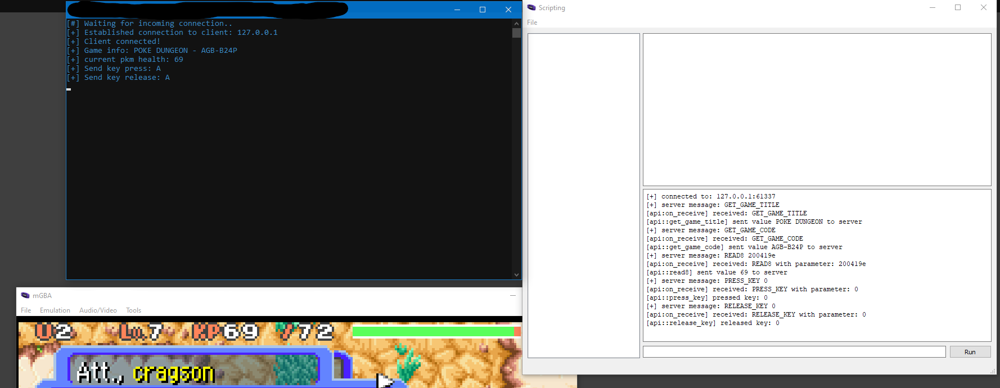

# mgba-api

This a wrapper for the mGBA Scripting API, which is written in C++ and Lua.
You can use this API to control the emulator from your C++ application under Windows.
This works by setting up a TCP client on the emulator and a TCP server in the API, which both needs to be initialized before usage.
The application is then able to send commands to the client, which will be executed (like e.g. read or write memory from the ROM of the emulator).



# Setup

 1. Clone the repo: `git clone git@github.com:cragson/mgba-api`
 2. Program your application which uses the API (examples can be found later on)
 3. Compile your application and execute it
 4. Run the `mgba-api.lua` in your mGBA emulator (mGBA > Tools > Scripting > Load Script)
 5. have fun


 - **The address and port  127.0.0.1:61337 is used by the server and client for communication**
 - **The maximum message length is 128 bytes**
 - **Commands have a custom format, which will be parsed from the Lua script running in mGBA**
 - **Some instructions (for e.g. write) need some confirmation message from the emulator, which is always "OK".**

## API Overview

The API supports the following commands:
| command  | description | raw message string example |
|--|--|--|
|read8| Reads 1 byte from memory | READ8 0xDEADAFFE
|read16| Reads 2 byte's from memory | READ16 0xDEADAFFE
|read32| Reads 4 byte's from memory| READ32 0xDEADAFFE 
|write8| Writes 1 byte to memory | WRITE8 0xDEADAFFE 69
|write16| Writes 2 byte's to memory | WRITE16 0xDEADAFFE 6969
|write32| Writes 4 byte's to memory| WRITE32 0xDEADAFFE 69696969
|get_game_title| Retrieves the game title from ROM| GET_GAME_TITLE
|get_game_code| Retrieves the game code from ROM| GET_GAME_CODE
|send_key_press| Sends a key press bit| PRESS_KEY 0
|send_key_release| Sends a key release bit| RELEASE_KEY 0
|press_key_once| Presses a key only once (press&release)| combines PRESS_KEY and RELEASE_KEY with custom delay


## Examples
**How to setup your C++ application** 
 ```cpp
  const auto api = std::make_unique< mgba_api >();

    if (!api->init_socket())
    {
        printf("[!] Could not initialize the socket!\n");

        return 1;
    }

    while (!api->wait_for_connection())
        Sleep(420);

    printf("[+] Client connected!\n");
  ```

**How to read 1 byte from memory** 
 ```cpp
  const auto api = std::make_unique< mgba_api >();

    if (!api->init_socket())
    {
        printf("[!] Could not initialize the socket!\n");

        return 1;
    }

    while (!api->wait_for_connection())
        Sleep(420);
    
    printf("[+] Client connected!\n");
    
    const auto current_health = api->read8(0x200419E);
  ```
**How to write 1 byte to memory** 
 ```cpp
  const auto api = std::make_unique< mgba_api >();

    if (!api->init_socket())
    {
        printf("[!] Could not initialize the socket!\n");

        return 1;
    }

    while (!api->wait_for_connection())
        Sleep(420);
   
    printf("[+] Client connected!\n");
        
    api->write8(0x200419E, 69);
  ```
  **How to retrieve the game title and code** 
 ```cpp
  const auto api = std::make_unique< mgba_api >();

    if (!api->init_socket())
    {
        printf("[!] Could not initialize the socket!\n");

        return 1;
    }

    while (!api->wait_for_connection())
        Sleep(420);
   
    printf("[+] Client connected!\n");
        
    const auto title = api->get_game_title();
	const auto code = api->get_game_code();

	printf("[+] Game info: %s - %s\n", title.c_str(), code.c_str() );
  ```
   **How to send a single key press** 
 ```cpp
  const auto api = std::make_unique< mgba_api >();

    if (!api->init_socket())
    {
        printf("[!] Could not initialize the socket!\n");

        return 1;
    }

    while (!api->wait_for_connection())
        Sleep(420);
   
    printf("[+] Client connected!\n");
        
    api->press_key_once(GBA_A); // 100ms is the default delay here until the key will be released
  ```

